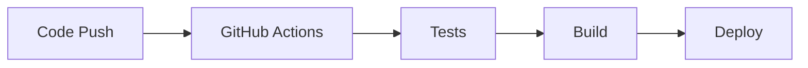

# SentWatch Platform - Technical Specification

## 1. Project Overview

### Purpose
- Digitalize and streamline security worker administration
- Manage employers and clients
- Handle scheduling and payments

### Target Audience
- Security agencies
- Freelance guards
- Businesses requiring security services

### Core Features
- Automated scheduling with drag-and-drop
- Incident reporting (image + text)
- Payment processing (Stripe)
- Real-time notifications
- Multi-language support (English, Somali, Arabic)

## 2. Technical Stack

### Frontend
- **Framework:** Next.js with React Server Components
- **Styling:** Tailwind CSS (mobile-first)
- **State Management:** React Context + Server Components
- **Language:** TypeScript

### Backend
- **Database:** Supabase
- **Authentication:** Supabase Auth
- **File Storage:** Supabase Storage
- **API:** Supabase Edge Functions

### Infrastructure
- **Hosting:** Vercel
- **CDN:** Vercel Edge Network
- **Caching:** Redis
- **Media:** Supabase Storage

## 3. Coding Standards

### File Structure
```
src/
  ├── app/                 # Next.js app router
  ├── components/          # React components
  ├── lib/                 # Utility functions
  ├── hooks/              # Custom React hooks
  ├── styles/             # Global styles
  ├── types/              # TypeScript types
  └── utils/              # Helper functions
```

### Naming Conventions
- **Files:** kebab-case (e.g., `my-component.tsx`)
- **Components:** PascalCase
- **Functions:** camelCase
- **Constants:** UPPER_SNAKE_CASE

### Code Style
```json
{
  "semi": false,
  "singleQuote": true,
  "trailingComma": "es5"
}
```

## 4. Database & Backend

### Supabase Schema
- Use SQL migrations for schema changes
- Implement Row Level Security (RLS)
- Follow naming conventions:
  - Tables: plural, snake_case
  - Columns: snake_case
  - Foreign keys: `table_name_id`

### Authentication
- JWT-based auth
- Role-based access control
- Secure password policies
- 2FA for admin accounts

### API Standards
- RESTful endpoints
- Rate limiting
- Error handling
- Request validation

## 5. Security & Compliance

### Security Measures
- HTTPS only
- CSP headers
- CORS configuration
- API rate limiting
- Input sanitization

### Data Privacy
- GDPR compliance
- KSA compliance
- Data encryption
- Secure data deletion

## 6. Performance & Scalability

### Performance Targets
- API response: <3s
- Page load: <2s
- First contentful paint: <1.5s

### Optimization Strategies
- Redis caching
- Database indexing
- Image optimization
- Code splitting

### Monitoring
- Error tracking
- Performance metrics
- User analytics
- Server monitoring

## 7. CI/CD & Deployment

### Environments
- Development
- Staging
- Production

### Deployment Process


### Version Control
- Feature branches
- Pull requests
- Code review
- Semantic versioning

## 8. Internationalization

### Language Support
- English (default)
- Arabic (RTL)
- Somali

### i18n Implementation
- Next.js i18n
- Auto language detection
- RTL support
- Regional formatting

### Regional Adaptations
- Currency formats
- Date/time formats
- Phone numbers
- Addresses

## 9. Testing Strategy

### Test Types
- Unit tests
- Integration tests
- E2E tests
- Performance tests

### Testing Tools
- Jest
- React Testing Library
- Cypress
- Lighthouse

## 10. Documentation

### Code Documentation
- JSDoc comments
- README files
- API documentation
- Component storybook

### User Documentation
- User guides
- API references
- Deployment guides
- Troubleshooting

## 11. Mobile Considerations

### Responsive Design
- Mobile-first approach
- Touch-friendly UI
- Offline capabilities
- PWA features

### Performance
- Lazy loading
- Image optimization
- Bundle optimization
- Service workers

## 12. Monitoring & Analytics

### Metrics
- User engagement
- Error rates
- Performance metrics
- Business KPIs

### Tools
- Vercel Analytics
- Error tracking
- User analytics
- Performance monitoring