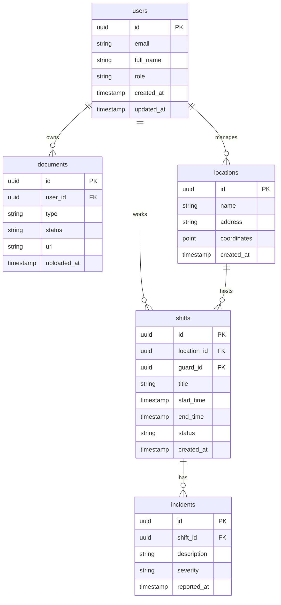

# Database Schema Documentation

## Overview
SentWatch uses Supabase (PostgreSQL) as the primary database. This document outlines the database schema, relationships, and security policies.

## Schema Diagram

## Tables

### users
Primary table for all user accounts.

### shifts
Stores all security shifts and assignments.

### documents
Manages user documents and verifications.

### locations
Stores all security locations and sites.

### incidents
Records security incidents during shifts.

## Security Policies
All tables implement Row Level Security (RLS) with specific policies for each user role.